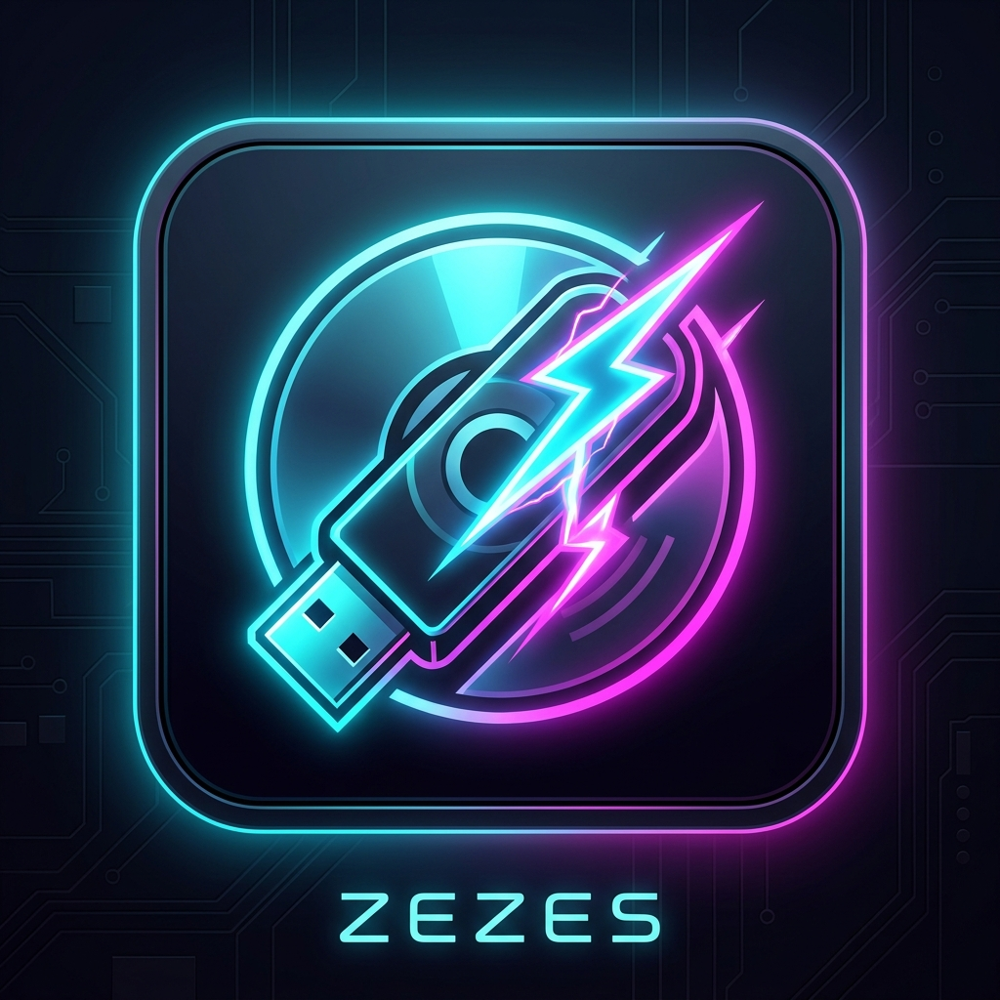

  

<h1 align="center">Zezes</h1>

  <b>Mobile ISO Deployment Core for Android</b> 
  Create bootable USB drives directly from your Android phone without root access.

  
  
  
  

---

## ⚡ Overview

**Zezes** is a high-performance, rootless Android application designed to flash operating system ISO images and create bootable USB drives directly from mobile devices using standard USB OTG.

Whether deploying Linux live distributions or setting up bootable Windows installation drives with automated 4GB+ file splitting, Zezes handles low-level USB storage communication efficiently and reliably.

---

## ✨ Key Features

### 🚀 Dual Deployment Modes
* **Raw Flash (Linux / Live Media)**:
  * Direct sector-by-sector writing optimized for hybrid Linux ISO images (Ubuntu, Fedora, Arch Linux, Debian, Tails, Proxmox, and more).
* **Extraction Engine (Windows Setup)**:
  * Formats target drives to FAT32 with clean boot record partitions and unpacks ISO file structures.
  * **Automated Large File Splitting**: Seamlessly breaks down Windows `install.wim` files exceeding the FAT32 4GB limit into spanned chunks without requiring manual user intervention.

### 🔌 Low-Level USB OTG Stack
* Native USB Host Mass Storage communication without needing root access.
* Automatic USB drive detection, partition analysis, and write verification.
* Broad hardware compatibility with USB thumb drives, OTG flash drives, memory card adapters, and external SSDs.

### 📊 Real-Time Telemetry & Console
* **Speed Performance Chart**: Live graphic display of transfer throughput (MB/s) with peak and average rate calculation.
* **Smart Time Estimator**: Real-time remaining and elapsed time indicators.
* **Terminal Console**: Live event monitoring and status logs during the deployment process.

### 🎨 Cyberpunk Theme Engine
Long-press the app icon in the toolbar to access 6 built-in color themes:
* 🌐 **Cyberpunk Neon** (Default high-contrast neon cyan & magenta)
* 🖤 **AMOLED Pitch Black** (Pure black OLED battery-saver mode)
* 🟢 **Matrix Green** (Retro terminal aesthetic)
* 🔮 **Deep Space Purple** (Vibrant space nebula theme)
* ☀️ **Clean Minimal Light** (Sleek light interface)
* 📜 **Solarized Light** (Warm, paper-like palette)

---

## 📱 Requirements

* **Android Version**: Android 8.0 (Oreo / API Level 26) or higher.
* **Hardware**: Device with USB OTG support and a USB OTG adapter/cable.
* **Target Storage**: USB flash drive or external storage drive.

---

## 📥 Installation

Download the latest APK from the official [Releases](https://github.com/killindodo/Zezes/releases) section and install it on your Android device.

---

## 👤 Author

* **killindodo** — [GitHub Profile](https://github.com/killindodo)

---

## 🔒 License & Copyright

Copyright © 2026 **killindodo**. All rights reserved.

This software is proprietary and confidential. Unauthorized copying, modification, distribution, reverse engineering, or reproduction of this software or any portion of it is strictly prohibited.
